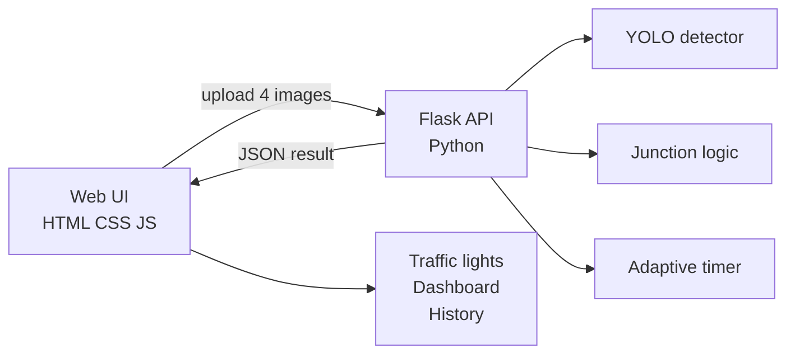

# Smart Traffic Signal Controller

**Adaptive junction-level traffic signal control powered by YOLOv5 vehicle detection.**

An intelligent traffic management system that analyzes lane-wise vehicle density from camera snapshots and dynamically assigns signal phases with adaptive green timings — including anti-starvation logic to prevent direction lock.

---

## Live Demo

**[https://smart-traffic-signal-m7v5.onrender.com](https://smart-traffic-signal-m7v5.onrender.com)**

Open the dashboard → **Detection** → upload 4 lane images → **Analyze Junction**.

> Free tier may sleep after inactivity; first load can take 30–60 seconds.

---

## Overview

Urban intersections face uneven traffic flow across directions. Fixed-time signals waste green time on empty lanes while congested lanes wait longer than necessary.

**Smart Traffic Signal Controller** solves this by:

1. Detecting vehicles in each lane using **YOLOv5**
2. Selecting the optimal signal phase using **rule-based junction logic**
3. Calculating **adaptive green duration** based on vehicle type and count
4. Visualizing decisions through a **web-based control dashboard**

---

## Features

- **YOLOv5 vehicle detection** — cars, buses, trucks, and motorbikes per lane
- **4-phase junction model** — North, South, East, West (P1–P4)
- **Anti-starvation logic** — prevents the same phase from dominating indefinitely
- **Adaptive green timer** — longer green for heavy vehicles; clamped min/max bounds
- **Web dashboard** — dashboard, junction view, detection upload, history, settings
- **Live signal visualization** — red / yellow / green with auto-cycle support
- **Dark mode** — full theme support across the UI
- **REST API** — Flask backend wrapping core Python modules

---

## Architecture



| Component | File | Role |
|-----------|------|------|
| Vehicle detection | `detector.py` | YOLOv5 inference on lane images |
| Phase selection | `junction.py` | Rule-based phase pick + anti-starvation |
| Green timing | `adaptive_timer.py` | Vehicle-weighted green duration |
| API server | `api.py` | Flask routes, sessions, static frontend |
| Frontend | `frontend/` | Dashboard UI (HTML, CSS, vanilla JS) |

---

## Tech Stack

| Layer | Technologies |
|-------|--------------|
| Frontend | HTML5, CSS3, JavaScript (ES6) |
| Backend | Python, Flask, Gunicorn |
| AI / CV | YOLOv5 (Ultralytics), PyTorch |
| Deployment | Render |

---

## Project Structure

```
Smart_Traffic_Signal_Controller/
├── api.py                 # Flask server (UI + REST API)
├── app.py                 # Tkinter desktop UI (legacy)
├── detector.py            # YOLO vehicle detector
├── junction.py            # Junction phase logic
├── adaptive_timer.py      # Adaptive green-time calculator
├── frontend/
│   ├── index.html         # Dashboard shell
│   ├── css/styles.css     # Design system & components
│   └── js/app.js          # Client logic & API calls
├── requirements.txt
├── render.yaml            # Render deployment config
└── README.md
```

---

## How It Works

1. Upload **four lane snapshots** — North, South, East, West
2. **YOLOv5** counts vehicles in each image
3. **Junction module** selects the active phase (busiest lane, with rotation if needed)
4. **Adaptive timer** computes green time from vehicle types in that phase
5. Dashboard displays **lane counts**, **active phase**, **timers**, and **traffic lights**
6. **Auto-cycle** rotates phases using updated session state

### Phase Mapping

| Phase | Direction |
|-------|-----------|
| P1 | North |
| P2 | South |
| P3 | East |
| P4 | West |

---

## Getting Started

### Prerequisites

- Python 3.9+
- pip

### Local Setup

```bash
git clone https://github.com/PrakritiNegii/Smart_Traffic_Signal_Controller.git
cd Smart_Traffic_Signal_Controller

python3 -m venv venv
source venv/bin/activate          # Windows: venv\Scripts\activate
pip install -r requirements.txt

PORT=5050 python api.py
```

Open **http://localhost:5050**

### Usage

1. Open **Detection** and upload 4 lane images (N, S, E, W)
2. Click **Analyze Junction**
3. Review results on **Dashboard** and **Junction**
4. Use **Auto Cycle** for continuous phase rotation

### Desktop App (Legacy)

```bash
python app.py
```

---

## API Reference

| Method | Endpoint | Description |
|--------|----------|-------------|
| `GET` | `/api/health` | Service health check |
| `POST` | `/api/analyze` | Upload 4 images → detection + phase decision |
| `POST` | `/api/next-cycle` | Advance to next signal phase |
| `POST` | `/api/reset` | Clear junction session state |

---

## Deployment (Render)

1. Push this repository to GitHub
2. Create a **Web Service** on [Render](https://render.com)
3. Configure:

| Setting | Value |
|---------|--------|
| Build Command | `pip install -r requirements.txt` |
| Start Command | `gunicorn api:app --bind 0.0.0.0:$PORT --timeout 120` |

4. Add environment variable: `SECRET_KEY` = a secure random string
5. Deploy and copy your public URL into the **Live Demo** section above

---

## Author

**Prakriti Negi**

- GitHub: [@PrakritiNegii](https://github.com/PrakritiNegii)
- LinkedIn: [prakriti-negi-39164b28a](https://www.linkedin.com/in/prakriti-negi-39164b28a/)

---

## License

This project is licensed under the **MIT License**.

---

## Acknowledgements

- [Ultralytics YOLOv5](https://github.com/ultralytics/ultralytics) for object detection
- [Flask](https://flask.palletsprojects.com/) for the REST API layer
